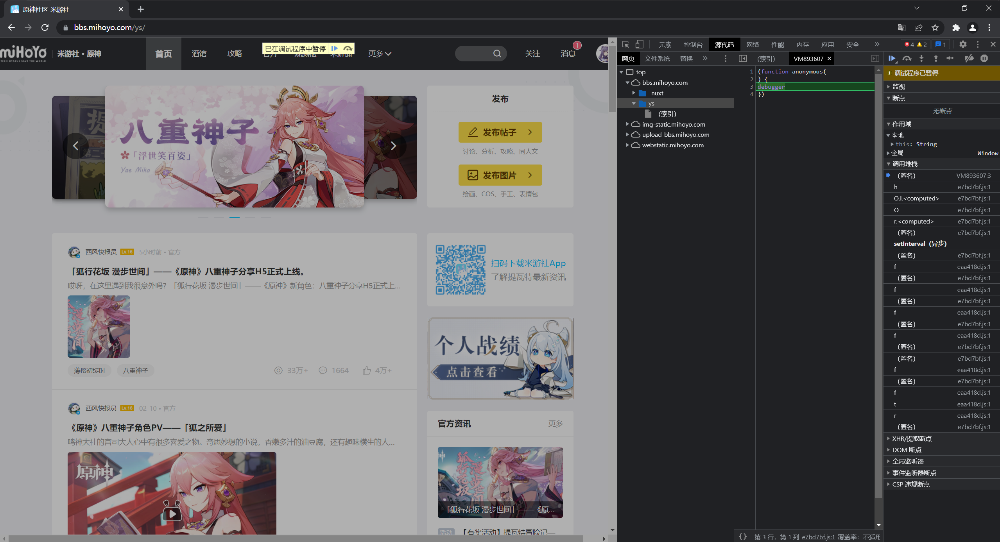
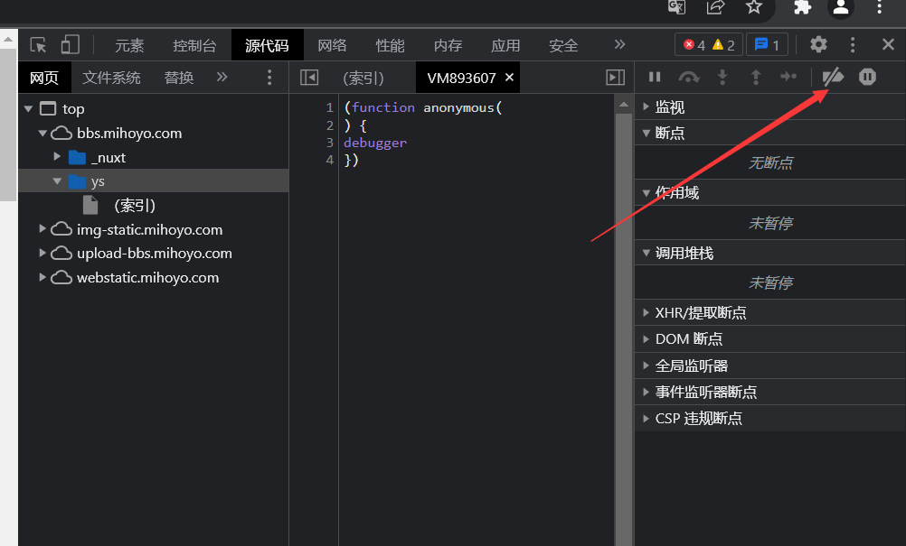
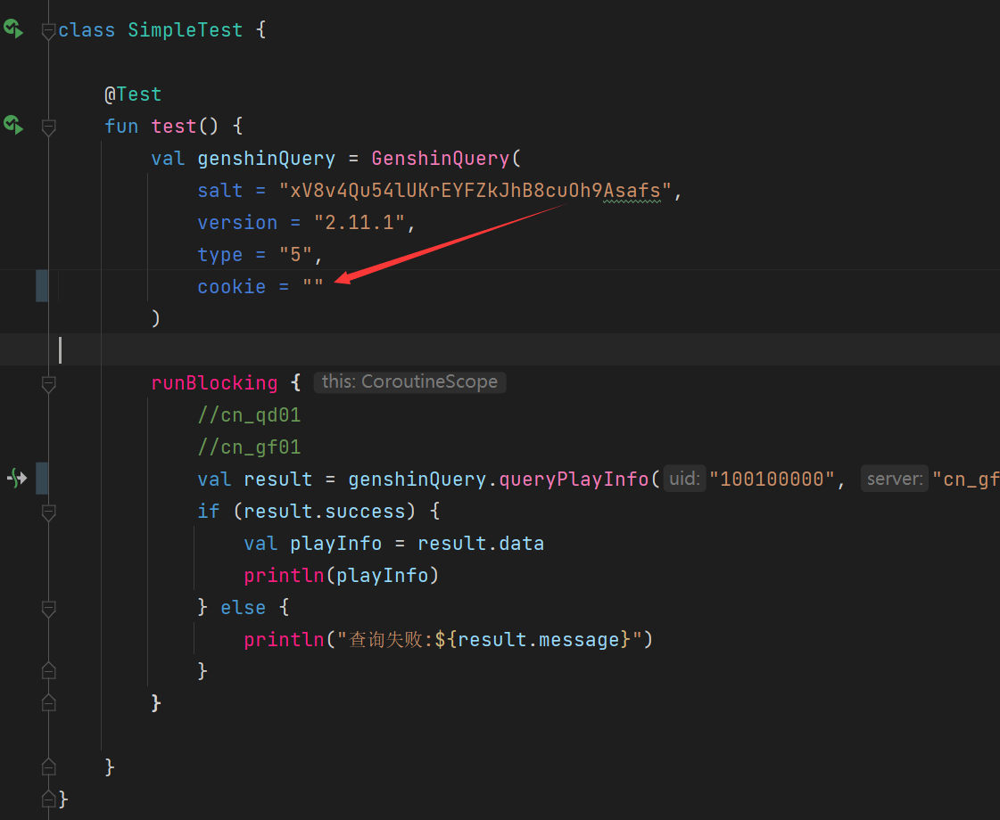

# 米友社原神查询

## 给朋友写的,我已经不玩这个游戏了

## 一切安全! 不要你号!

# 使用方法

1. 先在Chrome浏览器(其他浏览器自行想办法解决debugger中断问题)里 [米友社网页](https://bbs.mihoyo.com/ys/) 登录你的号
2. 然后按F12 他会给你中断
   
3. 然后你按Ctrl+F8或者点这个就可以
   
4. 然后运行下面这段代码点确定

```js
javascript:(function () {
    const cookie = document.cookie;
    const cookiePattern = /^(\S+)=(\S+)$/;
    const cookieArray = cookie.split("; ");
    const cookieMap = new Map();
    for (const item of cookieArray) {
        const resultArray = cookiePattern.exec(item);
        cookieMap.set(resultArray[1], resultArray[2]);
    }
    const cookieString = `cookie_token=${cookieMap.get("cookie_token")}; account_id=${cookieMap.get("account_id")};`
    console.log(cookieString);
    if (confirm("点击确定以复制cookie")) {
        copy(cookieString);
        return "已复制";
    } else {
        return "你取消了复制";
    }
})();
```

5. 给`GenshinQuery`类填充cookie参数按Ctrl+C粘贴进去
   